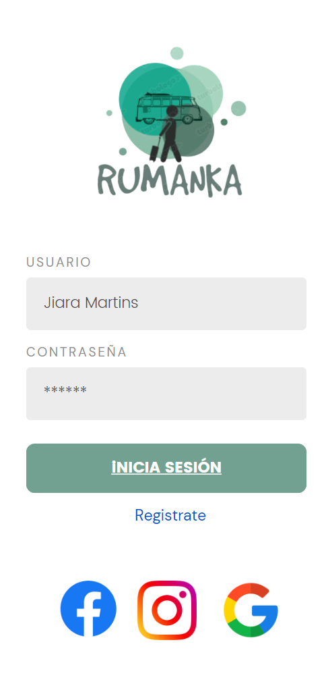
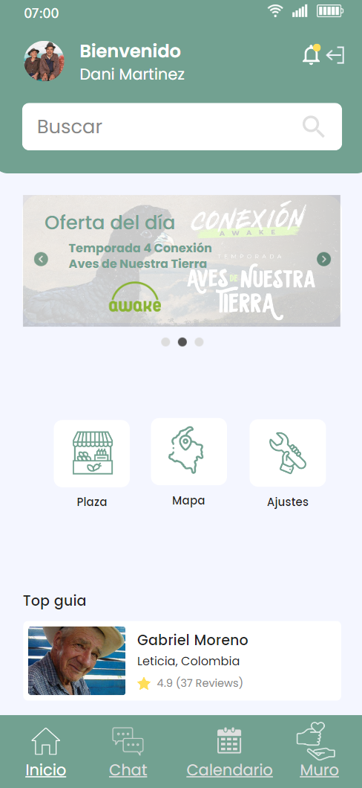
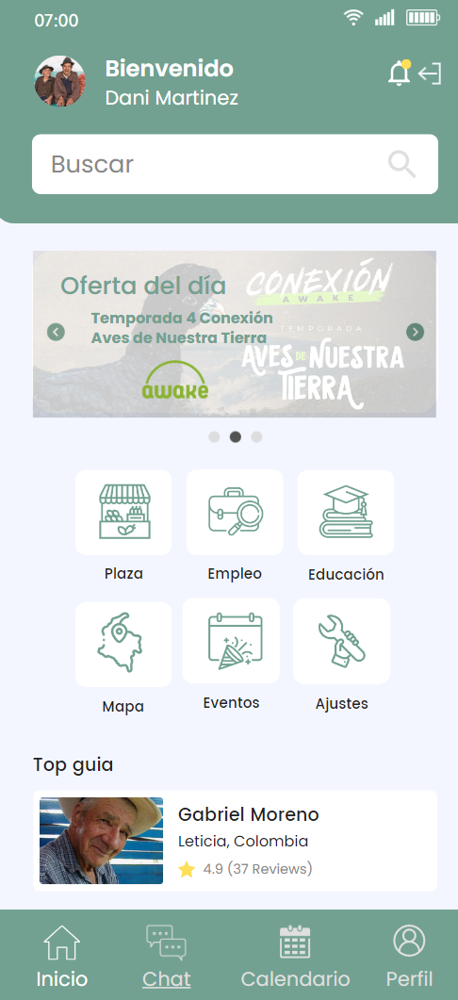
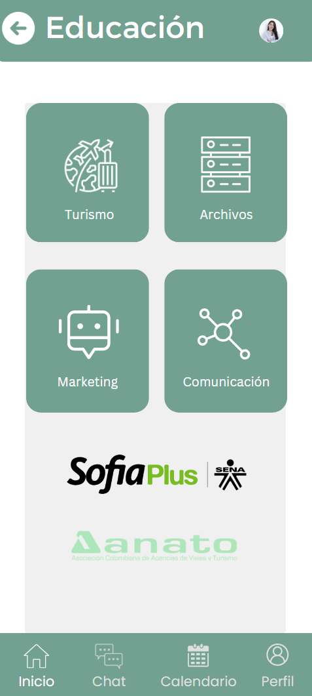
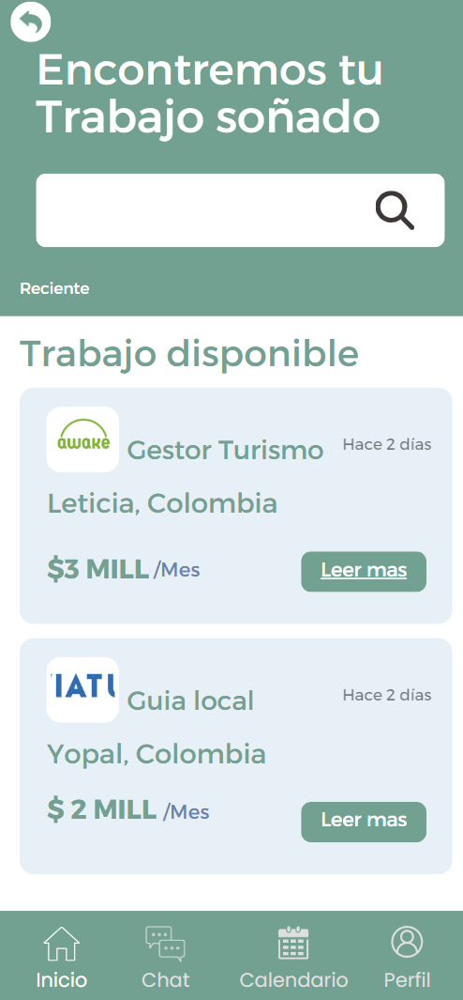
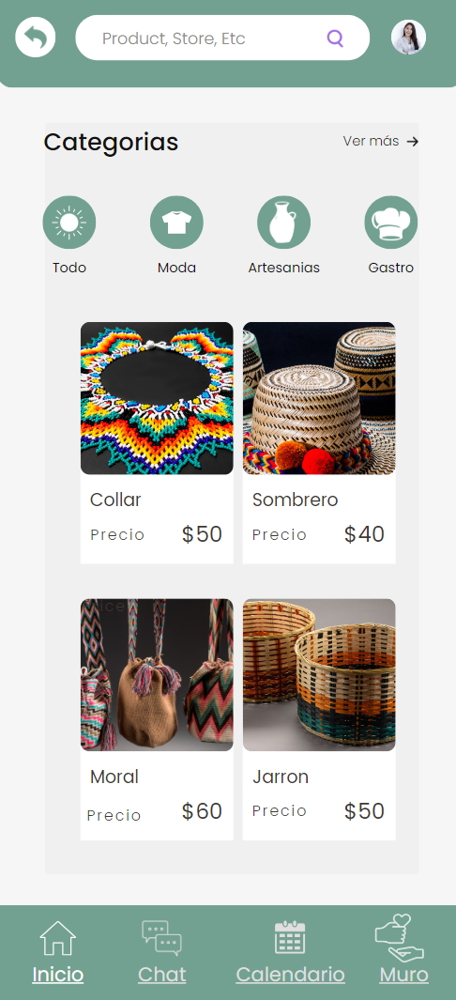
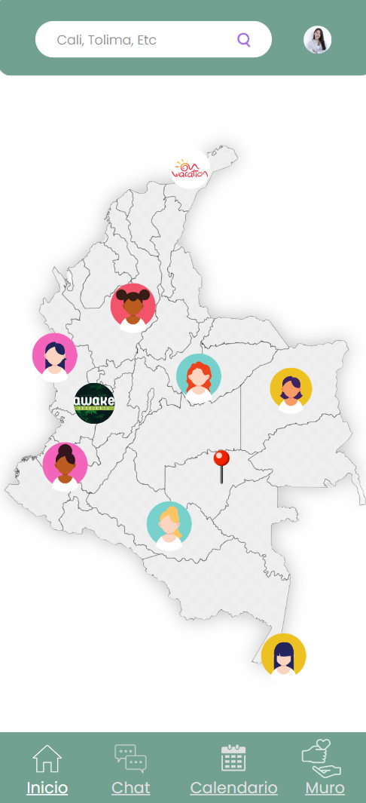
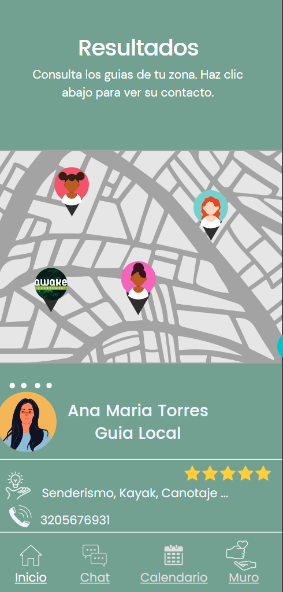
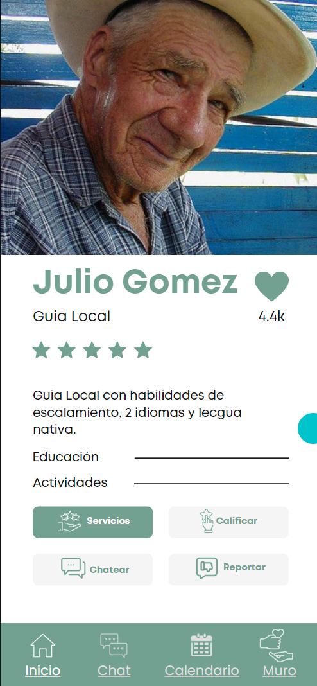

# Diseño de interfaz de usuario

La interfaz de usuario de la aplicación Rumanka es de inspiración propia.

El diseño completo esta disponible
en [Rumanka(]https://www.canva.com/design/DAFg16nm6Ds/XEtBusvQEWHlZSRAW2Kn_g/edit?utm_content=DAFg16nm6Ds&utm_campaign=designshare&utm_medium=link2&utm_source=sharebutton)

A continuación sepresentan las principales pantallas:

## 1. Loguin

   Cuando el usuario ingrese a la aplicaición debera realizar su ingreso. 

   

## 2. Menú turista

   El perfil turista una vez logueado, podrá visualizar un menú. 

   

## 3. Menú Guia

   El perfil Guia Local una vez logueado, podrá visualizar un menú. 

   

## 4. Educación

   El perfil Guia Local dentro de su menu podra ingresar a la opción Educación. 

   
   
## 5. Empleo

   El perfil Guia Local dentro de su menu podra ingresar a la opción Empleo. 

   
   
## 6. Plaza

   Los dos perfiles existentes para la aplicación podran visualizar dentro de su menú la opción de plaza.  

   

## 7. Mapa. 

   El mapa de colombia se podra visualizar dentro de los dos perfiles, pero sera de utilidad para los turistas para su consulta, filtro y acceso a perfiles de guias. 

   

Al realizar un filtro se podra acceder a un segundo resultado. 

   

## 8. Perfil.

   El guia local podra actualizar y organizar su perfil con sus servicios y habilidades según corresponsa. 

   

